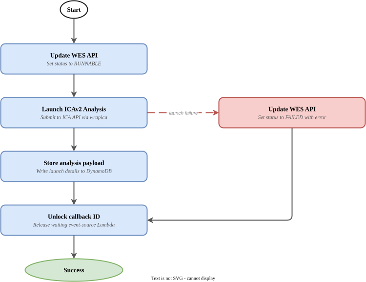
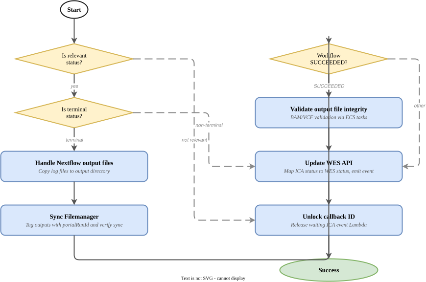
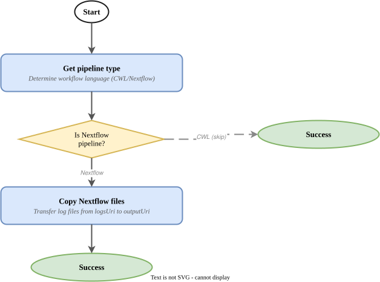
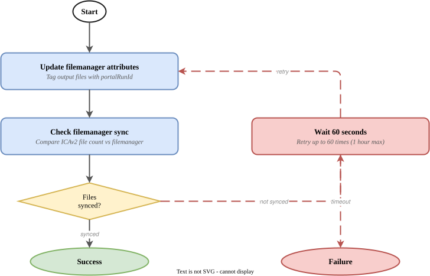
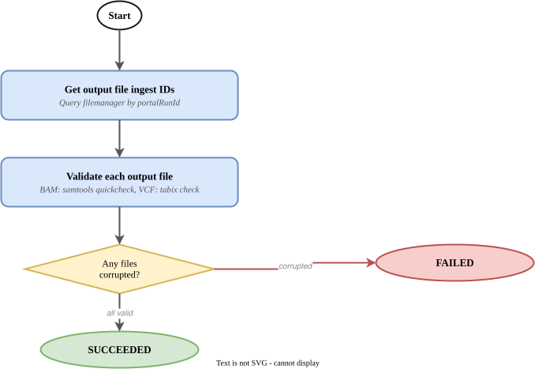

# ICAv2 WES Manager

- [Overview](#overview)
- [Pipeline State Flow](#pipeline-state-flow)
  - [1. Icav2WesRequest → Launch Analysis](#1-icav2wesrequest--launch-analysis)
  - [2. ICA state changes → WES status updates](#2-ica-state-changes--wes-status-updates)
  - [3. Abort Analysis](#3-abort-analysis)
- [Post-Completion Features](#post-completion-features)
  - [Nextflow Pipeline File Transfer](#nextflow-pipeline-file-transfer)
  - [Filemanager Sync](#filemanager-sync)
  - [Output File Integrity Validation](#output-file-integrity-validation)
- [Event Contract](#event-contract)
  - [Consumed Events](#consumed-events)
  - [Published Events](#published-events)
- [WES API](#wes-api)
  - [Endpoints](#endpoints)
  - [Status Lifecycle](#status-lifecycle)
- [Submitting an Analysis](#submitting-an-analysis)
  - [Via the WES API (curl)](#via-the-wes-api-curl)
  - [Via EventBridge](#via-eventbridge)
  - [CWL Pipeline Example](#cwl-pipeline-example)
  - [Nextflow Pipeline Example](#nextflow-pipeline-example)
- [Infrastructure](#infrastructure)
  - [Stateful Resources](#stateful-resources)
  - [Stateless Resources](#stateless-resources)
  - [Stacks](#stacks)
- [CI/CD and Release Management](#cicd-and-release-management)
- [Related Services](#related-services)
- [Setup](#setup)
- [Glossary & References](#glossary--references)

## Overview

This service manages the full lifecycle of bioinformatics analyses on
[Illumina Connected Analytics v2 (ICAv2)](https://help.ica.illumina.com/) —
submission, monitoring, post-completion processing, and status reporting.

It provides a unified interface (REST API + EventBridge events) that abstracts
the complexity of ICAv2's native analysis API, handles state change monitoring
via SQS notifications, and performs automated post-completion tasks including
Nextflow log file transfer, filemanager synchronisation, and BAM/VCF integrity
validation.

The service supports both **CWL** and **Nextflow** pipeline languages on ICAv2.

**Upstream:** Any OrcaBus service that emits `Icav2WesRequest` events (e.g.
[Dragen WGTS DNA Pipeline Manager](https://github.com/OrcaBus/service-dragen-wgts-dna-pipeline-manager),
[Sash Pipeline Manager](https://github.com/OrcaBus/service-sash-pipeline-manager),
[Analysis Glue](https://github.com/OrcaBus/service-analysis-glue))

**Downstream:** Any OrcaBus service that consumes `Icav2WesAnalysisStateChange` events (e.g.
[Dragen WGTS DNA Pipeline Manager](https://github.com/OrcaBus/service-dragen-wgts-dna-pipeline-manager),
[Oncoanalyser WGTS DNA](https://github.com/OrcaBus/service-oncoanalyser-wgts-dna-pipeline-manager))

## Pipeline State Flow

The service orchestrates multiple Step Functions state machines that manage an
analysis from initial request through ICAv2 execution to completion reporting.

### 1. Icav2WesRequest → Launch Analysis

State machine: [`launch_icav2_analysis_sfn_template`](app/step-functions-templates/launch_icav2_analysis_sfn_template.asl.json)



When an `Icav2WesRequest` event arrives (via the WES Request SQS queue or API),
this state machine submits the analysis to ICAv2:

1. **Update WES API** — sets the analysis status to `RUNNABLE`
2. **Launch ICAv2 Analysis** — calls the ICA API via wrapica to submit the
   CWL/Nextflow analysis with the provided inputs, engine parameters, and tags
3. **Store analysis payload** — writes the launch payload to DynamoDB for
   auditability (retained 180 days)
4. **Unlock callback ID** — releases the waiting event-source Lambda that
   submitted the request

On launch failure, the status is set to `FAILED` with the appropriate error
type (`CreateAnalysisInputFailure`, `AnalysisLaunchFailure`, or
`PipelineNotFoundFailure`).

### 2. ICA state changes → WES status updates

State machine: [`handle_icav2_analysis_state_change_sfn_template`](app/step-functions-templates/handle_icav2_analysis_state_change_sfn_template.asl.json)



Triggered by ICAv2 SQS notifications when an analysis changes state. This
orchestrator state machine:

1. **Filters relevant statuses** — only processes `INITIALIZING`, `IN_PROGRESS`,
   `SUCCEEDED`, `FAILED`, `FAILED_FINAL`, `ABORTED`
2. **For terminal states** (SUCCEEDED, FAILED, ABORTED):
   - Runs [Nextflow file transfer](#nextflow-pipeline-file-transfer)
   - Runs [Filemanager sync](#filemanager-sync)
   - For SUCCEEDED: runs [integrity validation](#output-file-integrity-validation)
3. **Updates the WES API** — maps ICA status to WES status and emits a state
   change event
4. **Unlocks callback ID** — releases the waiting `handleIcaEvent` Lambda

### 3. Abort Analysis

State machine: [`abort_icav2_analysis_sfn_template`](app/step-functions-templates/abort_icav2_analysis_sfn_template.asl.json)

A simple single-step state machine that calls the ICA API to abort a running
analysis. Retries with 60-second intervals (max 3 attempts).

## Post-Completion Features

When an analysis reaches a terminal state, the following post-processing steps
run automatically before the final status is reported.

### Nextflow Pipeline File Transfer

State machine: [`handle_nextflow_files_sfn_template`](app/step-functions-templates/handle_nextflow_files_sfn_template.asl.json)



For Nextflow pipelines, ICAv2 places execution metadata (e.g. `nextflow.log`,
`.command.*` files, `trace.txt`) in the `logsUri` rather than the `outputUri`.
This state machine:

1. Determines the pipeline language (CWL or Nextflow)
2. If Nextflow: copies log files from `logsUri` to `outputUri` so all artefacts
   are co-located

CWL pipelines skip this step entirely.

### Filemanager Sync

State machine: [`handle_filemanager_sfn_template`](app/step-functions-templates/handle_filemanager_sfn_template.asl.json)



Ensures the OrcaBus [Filemanager](https://github.com/OrcaBus/orcabus) has
indexed all output files:

1. **Tags output files** with `portalRunId` attributes in the filemanager
2. **Verifies sync** — compares the file count in the filemanager against ICAv2
3. **Retries** every 60 seconds for up to 1 hour if counts don't match
4. **Fails** if sync is not achieved within the timeout

### Output File Integrity Validation

State machine: [`handle_corrupted_files_sfn_template`](app/step-functions-templates/handle_corrupted_files_sfn_template.asl.json)



For SUCCEEDED analyses, validates the integrity of critical output files:

1. Queries the filemanager for all output file ingest IDs by `portalRunId`
2. For each file (processed in batches of 50):
   - **BAM files** → validates via `samtools quickcheck` (ECS Fargate task)
   - **VCF index files** (`.tbi`) → validates the associated VCF via `tabix`
     (ECS Fargate task)
   - **Other files** → checks for corruption indicators via filemanager metadata
3. If any corrupted files are found, the analysis status is overridden to
   `FAILED` with error type `AnalysisOutputFileCorruption` and a message listing
   the corrupted S3 URIs

## Event Contract

### Consumed Events

| Event | Source | DetailType | Description |
|-------|--------|------------|-------------|
| WES Request | Any (not `orcabus.icav2wesmanager`) | `Icav2WesRequest` | Triggers a new ICAv2 analysis submission |
| ICA State Change | ICAv2 (via SQS) | N/A (SQS notification) | ICAv2 analysis status updates filtered by `icav2_wes_orcabus_id` tag |

### Published Events

| Event | Source | DetailType | Description |
|-------|--------|------------|-------------|
| Analysis State Change | `orcabus.icav2wesmanager` | `Icav2WesAnalysisStateChange` | Emitted on every WES status transition |

## WES API

The API is served via FastAPI on Lambda behind API Gateway with Cognito
authentication.

**Base URL:** `https://icav2-wes.<environment>.umccr.org`

**Swagger:** `https://icav2-wes.<environment>.umccr.org/schema/swagger-ui`

### Endpoints

| Method | Path | Auth | Description |
|--------|------|------|-------------|
| `GET` | `/api/v1/analysis/` | Cognito | List analyses (filterable by `name`, `status`) |
| `GET` | `/api/v1/analysis/{id}` | Cognito | Get a single analysis by orcabus ID |
| `POST` | `/api/v1/analysis/` | Cognito | Create and launch a new analysis |
| `PATCH` | `/api/v1/analysis/{id}` | Internal | Update analysis status (used by Step Functions) |
| `PATCH` | `/api/v1/analysis/{id}:abort` | Cognito | Abort a running analysis |

### Status Lifecycle

ICAv2 has many intermediate states. The WES Manager maps these to a simplified
lifecycle inspired by [AWS Batch](https://docs.aws.amazon.com/batch/latest/APIReference/API_JobDetail.html):

| WES Status | Trigger |
|------------|---------|
| `SUBMITTED` | Analysis record created in WES API |
| `RUNNABLE` | Launch Step Function has started |
| `STARTING` | ICAv2 reports `INITIALIZING` |
| `RUNNING` | ICAv2 reports `IN_PROGRESS` |
| `SUCCEEDED` | ICAv2 reports `SUCCEEDED` and integrity checks pass |
| `FAILED` | ICAv2 reports `FAILED`/`FAILED_FINAL`, launch failure, or integrity check failure |
| `ABORTED` | ICAv2 reports `ABORTED` |

## Submitting an Analysis

An analysis can be submitted either via the REST API or by putting an event on
the `OrcaBusMain` EventBridge bus.

### Via the WES API (curl)

```bash
curl \
  --silent --show-error --location --fail \
  --request "POST" \
  --header "Accept: application/json" \
  --header "Authorization: Bearer ${ORCABUS_TOKEN}" \
  --header "Content-Type: application/json" \
  --data '{
    "name": "my-analysis--unique-run-name",
    "inputs": { ... },
    "engineParameters": {
      "pipelineId": "<icav2-pipeline-uuid>",
      "projectId": "<icav2-project-uuid>",
      "outputUri": "s3://<bucket>/<output-prefix>/",
      "logsUri": "s3://<bucket>/<logs-prefix>/",
      "cacheUri": "s3://<bucket>/<cache-prefix>/"
    },
    "tags": {
      "portalRunId": "<portal-run-id>",
      "myCustomTag": "value"
    }
  }' \
  --url "https://icav2-wes.${ENVIRONMENT}.umccr.org/api/v1/analysis/"
```

### Via EventBridge

```json
{
  "EventBusName": "OrcaBusMain",
  "Source": "orcabus.yourservice",
  "DetailType": "Icav2WesRequest",
  "Detail": {
    "name": "my-analysis--unique-run-name",
    "inputs": { ... },
    "engineParameters": {
      "pipelineId": "<icav2-pipeline-uuid>",
      "projectId": "<icav2-project-uuid>",
      "outputUri": "s3://<bucket>/<output-prefix>/",
      "logsUri": "s3://<bucket>/<logs-prefix>/",
      "cacheUri": "s3://<bucket>/<cache-prefix>/"
    },
    "tags": {
      "portalRunId": "<portal-run-id>"
    }
  }
}
```

### CWL Pipeline Example

CWL inputs use the standard CWL object model with `class` and `location` fields:

```json5
{
  "name": "bclconvert-interop-qc--20231010_pi1-07_0329_A222N7LTD3",
  "inputs": {
    "bclconvert_report_directory": {
      "class": "Directory",
      "location": "s3://pipeline-dev-cache-503977275616-ap-southeast-2/byob-icav2/development/primary/20231010_pi1-07_0329_A222N7LTD3/202504179cac7411/Reports/"
    },
    "interop_directory": {
      "class": "Directory",
      "location": "s3://pipeline-dev-cache-503977275616-ap-southeast-2/byob-icav2/development/primary/20231010_pi1-07_0329_A222N7LTD3/202504179cac7411/InterOp/"
    },
    "instrument_run_id": "20231010_pi1-07_0329_A222N7LTD3"
  },
  "engineParameters": {
    "pipelineId": "55a8bb47-d32b-48dd-9eac-373fd487ccec",
    "projectId": "ea19a3f5-ec7c-4940-a474-c31cd91dbad4",
    "outputUri": "s3://pipeline-dev-cache-503977275616-ap-southeast-2/byob-icav2/development/analysis-output/bclconvert-interop-qc/20231010_pi1-07_0329_A222N7LTD3/",
    "logsUri": "s3://pipeline-dev-cache-503977275616-ap-southeast-2/byob-icav2/development/logs/bclconvert-interop-qc/20231010_pi1-07_0329_A222N7LTD3/"
  },
  "tags": {
    "portalRunId": "202407015a1b2c3d",  // pragma: allowlist secret
    "instrument_run_id": "20231010_pi1-07_0329_A222N7LTD3"
  }
}
```

### Nextflow Pipeline Example

Nextflow inputs use S3 URIs directly (no `class`/`location` wrapper). The
`cacheUri` engine parameter enables Nextflow resume/caching:

```json5
{
  "name": "oncoanalyser-wgts-dna--L2301368",
  "inputs": {
    "mode": "wgts",
    "sample_name": "L2301368",
    "tumor_wgs_bam": "s3://pipeline-prod-cache-503977275616-ap-southeast-2/byob-icav2/production/analysis-output/dragen-wgts-dna/L2301368/L2301368_tumor.bam",
    "normal_wgs_bam": "s3://pipeline-prod-cache-503977275616-ap-southeast-2/byob-icav2/production/analysis-output/dragen-wgts-dna/L2301368/L2301368_normal.bam",
    "ref_data_hmf_data_path": "s3://pipeline-prod-refdata-503977275616-ap-southeast-2/oncoanalyser/hmf_data/",
    "ref_data_genome_version": "38"
  },
  "engineParameters": {
    "pipelineId": "a1b2c3d4-e5f6-7890-abcd-ef1234567890",
    "projectId": "ea19a3f5-ec7c-4940-a474-c31cd91dbad4",
    "outputUri": "s3://pipeline-prod-cache-503977275616-ap-southeast-2/byob-icav2/production/analysis-output/oncoanalyser-wgts-dna/L2301368/",
    "logsUri": "s3://pipeline-prod-cache-503977275616-ap-southeast-2/byob-icav2/production/logs/oncoanalyser-wgts-dna/L2301368/",
    "cacheUri": "s3://pipeline-prod-cache-503977275616-ap-southeast-2/byob-icav2/production/cache/oncoanalyser-wgts-dna/",
    "analysisStorageSize": "LARGE"
  },
  "tags": {
    "portalRunId": "20240801abcdef12",  // pragma: allowlist secret
    "libraryId": "L2301368",
    "subjectId": "SBJ03456"
  }
}
```

**Engine Parameters Reference:**

| Parameter | Required | Description |
|-----------|----------|-------------|
| `projectId` | Yes | ICAv2 project context for the analysis |
| `pipelineId` | Yes | ICAv2 pipeline ID to execute |
| `outputUri` | Yes | S3 output directory (must end with `/`) |
| `logsUri` | Yes | S3 logs directory (must end with `/`) |
| `cacheUri` | Yes | S3 cache directory for Nextflow resume |
| `analysisStorageSize` | No | One of `SMALL`, `MEDIUM`, `LARGE`, `XLARGE`, `2XLARGE`, `3XLARGE` |

## Infrastructure

The service is deployed via AWS CDK. Resources are split into two stacks:
stateful (data/queues) and stateless (compute/events).

Event bus: `OrcaBusMain`
Event source: `orcabus.icav2wesmanager`

### Stateful Resources

| Resource | Name | Purpose |
|----------|------|---------|
| DynamoDB Table | `icav2WesManagerApiDynamoDBTable` | Main API data store (indexes: `name`, `status`) |
| DynamoDB Table | `icav2WesManagerPayloadsTable` | Stores compressed analysis launch payloads |
| DynamoDB Table | `icav2WesManagerCallbackTable` | Durable execution callback tracking |
| S3 Bucket | `icav2-wes-artifacts-<account>-<region>` | Analysis payloads and error logs |
| SQS Queue | `Icav2WesRequestSqsQueue` | Buffers incoming WES request events |
| SQS Queue | `Icav2WesAnalysisSqsQueue` | Receives ICAv2 state change notifications |

### Stateless Resources

| Resource | Count | Description |
|----------|-------|-------------|
| Lambda Functions | 17 | Python 3.14, ARM64 — one per task |
| Step Functions | 6 | ASL templates in [`app/step-functions-templates/`](app/step-functions-templates) |
| ECS Fargate Tasks | 2 | BAM validation, VCF validation |
| EventBridge Rules | 1 | Routes `Icav2WesRequest` events to the SQS queue |
| API Gateway | 1 | HTTP API with Cognito authorizer |

### Stacks

The CDK project deploys a CodePipeline in the toolchain account that promotes
changes to `beta`, `gamma`, and `prod`.

```sh
# List stateless stacks
pnpm cdk-stateless ls
# OrcaBusStatelessICAv2WesStack
# OrcaBusStatelessICAv2WesStack/.../OrcaBusBeta/DeployStack
# OrcaBusStatelessICAv2WesStack/.../OrcaBusGamma/DeployStack
# OrcaBusStatelessICAv2WesStack/.../OrcaBusProd/DeployStack

# List stateful stacks
pnpm cdk-stateful ls
# OrcabusStatefulICAv2WesStack
# OrcabusStatefulICAv2WesStack/.../OrcaBusBeta/DeployStack
# OrcabusStatefulICAv2WesStack/.../OrcaBusGamma/DeployStack
# OrcabusStatefulICAv2WesStack/.../OrcaBusProd/DeployStack
```

## CI/CD and Release Management

All changes merged to `main` are automatically built and deployed to `beta` and
`gamma`. Promotion to `prod` requires manually enabling the CodePipeline
transition in the AWS console.

## Related Services

| Relationship | Service | Description |
|-------------|---------|-------------|
| Upstream | [Dragen WGTS DNA Pipeline Manager](https://github.com/OrcaBus/service-dragen-wgts-dna-pipeline-manager) | Submits DRAGEN DNA analyses |
| Upstream | [Sash Pipeline Manager](https://github.com/OrcaBus/service-sash-pipeline-manager) | Submits Sash analyses |
| Upstream | [Analysis Glue](https://github.com/OrcaBus/service-analysis-glue) | Orchestrates pipeline trigger logic |
| Downstream | [Dragen WGTS DNA Pipeline Manager](https://github.com/OrcaBus/service-dragen-wgts-dna-pipeline-manager) | Consumes state change events |
| Downstream | [Oncoanalyser WGTS DNA](https://github.com/OrcaBus/service-oncoanalyser-wgts-dna-pipeline-manager) | Consumes state change events |
| Dependency | [Filemanager](https://github.com/OrcaBus/orcabus) | File indexing and attribute tagging |
| Dependency | [Workflow Manager](https://github.com/OrcaBus/orcabus) | Workflow state tracking |
| External | [ICAv2 API](https://help.ica.illumina.com/) | Illumina Connected Analytics execution engine |

## Setup

### Requirements

```sh
node --version  # v22+
corepack enable pnpm
```

### Install Dependencies

```sh
make install
```

### Commands

```sh
make check     # Run linting, formatting, and audit checks
make fix       # Auto-fix linting and formatting issues
make test      # Run CDK nag tests
```

### CDK Commands

```sh
pnpm cdk-stateless synth    # Synthesize stateless stack
pnpm cdk-stateful synth     # Synthesize stateful stack
pnpm cdk-stateless deploy OrcaBusStatelessICAv2WesStack/.../<stage>/DeployStack
```

## Glossary & References

| Term | Description |
|------|-------------|
| ICAv2 | Illumina Connected Analytics v2 — the cloud compute platform |
| WES | Workflow Execution Service — the REST interface this service exposes |
| Orcabus ID | ULID-based identifier with a 3-char prefix (e.g. `iwa.01JWAGE5PWS5JN48VWNPYSTJRN`) |
| portalRunId | Unique run identifier used across OrcaBus services to correlate pipeline outputs |
| Durable Execution | AWS Lambda pattern using callback IDs for long-running async coordination |

- Platform glossary: [OrcaBus wiki](https://github.com/OrcaBus/wiki/blob/main/orcabus-platform/README.md#glossary--references)
- ICAv2 pipeline orchestration pattern: [OrcaBus wiki — Pipeline Architecture](https://github.com/OrcaBus/wiki/blob/main/orcabus/platform/pipelines.md#pipeline-orchestration-general-logic)
- Event schemas: [`app/event-schemas/`](app/event-schemas)
